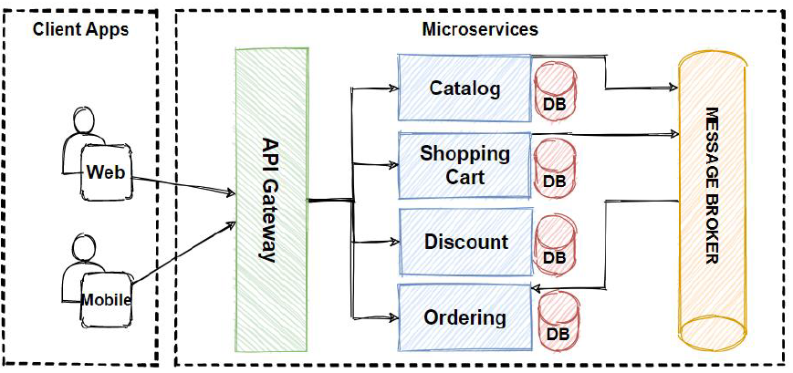
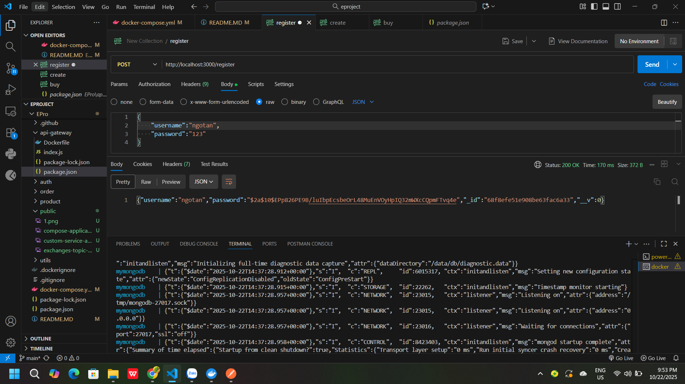
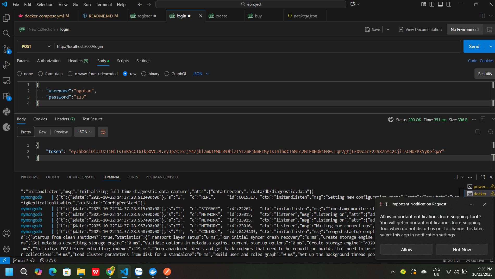

## 1️⃣ Hệ thống giải quyết vấn đề gì?

Hệ thống được xây dựng để mô phỏng hoạt động của một website thương mại điện tử cơ bản, trong đó:

* Người dùng có thể đăng ký – đăng nhập tài khoản.

* Quản trị viên có thể thêm sản phẩm.

* Người dùng có thể đặt hàng trực tiếp.

Hệ thống có khả năng xử lý nhiều tác vụ song song, linh hoạt mở rộng nhờ áp dụng kiến trúc Microservices.
➡️ Mục tiêu chính: Mô phỏng quy trình vận hành thực tế của một trang TMĐT đơn giản từ xác thực đến xử lý đơn hàng.

## 2️⃣ Hệ thống có bao nhiêu dịch vụ?

Tổng cộng có 4 service chính và 2 service phụ trợ:

Loại	  Tên Service	    Vai trò
Chính	  Auth Service	  Quản lý người dùng
Chính	  Product Service	Quản lý sản phẩm
Chính	  Order Service	  Xử lý đơn hàng
Chính	  API Gateway	    Trung gian điều phối request
Phụ	    MongoDB	        Lưu trữ dữ liệu
Phụ	    RabbitMQ	      Message Broker trung gian
## 3️⃣ Ý nghĩa từng dịch vụ

Auth Service 🧍
→ Xử lý đăng ký, đăng nhập, sinh token JWT, xác thực quyền truy cập.

Product Service 📦
→ Quản lý sản phẩm, thêm – sửa – xóa – lấy thông tin sản phẩm.

Order Service 🛒
→ Tạo đơn hàng, xác thực token, tương tác với Product để lấy thông tin sản phẩm.

API Gateway 🚪
→ Nhận tất cả request từ client, định tuyến đến các service phù hợp, giúp hệ thống có một điểm truy cập duy nhất.

MongoDB 🗃️
→ Lưu dữ liệu người dùng, sản phẩm và đơn hàng theo từng service riêng biệt.

RabbitMQ 📨
→ Đảm bảo các service có thể giao tiếp bất đồng bộ (event-driven), tránh nghẽn hệ thống khi có nhiều đơn hàng.

## 4️⃣ Các mẫu thiết kế được sử dụng
Mẫu thiết kế	Mô tả	Áp dụng
Microservices Pattern	Tách hệ thống thành nhiều service độc lập, dễ mở rộng & bảo trì	Auth, Product, Order
API Gateway Pattern	Gom các request vào 1 điểm truy cập duy nhất	api-gateway
Event-driven Architecture	Sử dụng message queue để giao tiếp service bất đồng bộ	RabbitMQ
Repository Pattern (mức logic code)	Tách biệt logic truy cập dữ liệu với logic nghiệp vụ	Mỗi service Node.js
## 5️⃣ Các dịch vụ giao tiếp như thế nào?



Client gửi request đến API Gateway.

API Gateway định tuyến đến service tương ứng:

/register, /login → Auth Service

/products → Product Service

/orders → Order Service

Khi tạo đơn hàng, Order Service gửi message qua RabbitMQ để thông báo và xử lý logic liên quan mà không làm chậm request của người dùng.

Mỗi service kết nối đến database riêng trên MongoDB, đảm bảo tính độc lập và mở rộng.
# E-Project: Hệ thống Microservices Bán hàng

Đây là một dự án backend mô phỏng một hệ thống thương mại điện tử đơn giản, được xây dựng theo kiến trúc microservices.

## Kiến trúc hệ thống

Hệ thống bao gồm các thành phần chính sau:
* **API Gateway**: Cổng chính tiếp nhận tất cả request từ client và điều hướng đến các service phù hợp.
* **Auth Service**: Xử lý tất cả các vấn đề liên quan đến xác thực người dùng (đăng ký, đăng nhập, JWT).
* **Product Service**: Quản lý thông tin về sản phẩm.
* **Order Service**: Xử lý logic đặt hàng và tương tác với các service khác qua message queue.
* **MongoDB**: Cơ sở dữ liệu NoSQL để lưu trữ dữ liệu cho các service.
* **RabbitMQ**: Message Broker để giao tiếp bất đồng bộ giữa các service (ví dụ: khi một đơn hàng được tạo).


---

## Yêu cầu cài đặt

Để chạy dự án này, bạn cần cài đặt các phần mềm sau trên máy tính của mình:
* [Docker](https://www.docker.com/products/docker-desktop/) và Docker Compose
* [Postman](https://www.postman.com/downloads/) (để test API)
* [Git](https://git-scm.com/downloads/)

---

## Cài đặt và Chạy dự án với Docker

Đây là cách đơn giản và được khuyến khích để chạy toàn bộ hệ thống chỉ với một vài lệnh.

### Bước 1: Tải mã nguồn

```bash
Clone dự án về
```

### Bước 2: Tạo các file cấu hình Docker

Bạn cần tạo các file sau trong dự án của mình.

#### a. Tạo `Dockerfile` cho mỗi service

Tạo một file tên là `Dockerfile` trong **mỗi thư mục service** (`auth`, `product`, `order`, `api-gateway`) với nội dung giống hệt nhau:

```dockerfile
# Sử dụng một image Node.js chính thức làm nền
FROM node:18-alpine

# Tạo thư mục làm việc bên trong container
WORKDIR /app

# Sao chép package.json và package-lock.json
COPY package*.json ./

# Cài đặt các dependencies
RUN npm install

# Sao chép toàn bộ mã nguồn của service vào
COPY . .

# Mở cổng mà ứng dụng sẽ chạy
EXPOSE 3000

# Lệnh để khởi chạy ứng dụng
CMD ["npm", "start"]
```

#### b. Tạo file `docker-compose.yml`

Ở thư mục **gốc** của dự án, tạo một file tên là `docker-compose.yml` với nội dung sau:

```yaml
services:
  # Service MongoDB
  mongo:
    image: mongo
    ports:
      - "27017:27017"
    volumes:
      - mongo-data:/data/db

  # Service RabbitMQ
  rabbitmq:
    image: rabbitmq:3-management
    ports:
      - "5672:5672"
      - "15672:15672"

  # Service Auth
  auth:
    build: ./auth
    ports:
      - "3001:3000"
    environment:
      - MONGODB_AUTH_URI=mongodb://mongo:27017/auth_db
      - JWT_SECRET=daylamotkhoabimatratmanhcuaban
    depends_on:
      - mongo

  # Service Product
  product:
    build: ./product
    ports:
      - "3002:3000"
    environment:
      - MONGODB_PRODUCT_URI=mongodb://mongo:27017/product_db
    depends_on:
      - mongo
      - rabbitmq

  # Service Order
  order:
    build: ./order
    ports:
      - "3003:3000"
    environment:
      - MONGODB_ORDER_URI=mongodb://mongo:27017/order_db
    depends_on:
      - mongo
      - rabbitmq

  # API Gateway
  api-gateway:
    build: ./api-gateway
    ports:
      - "3000:3000"
    depends_on:
      - auth
      - product
      - order

volumes:
  mongo-data:
```

### Bước 3: Khởi chạy hệ thống

Mở terminal ở thư mục gốc của dự án và chạy lệnh:
```bash
docker-compose up --build
```
Lệnh này sẽ build image cho từng service và khởi chạy toàn bộ hệ thống. Bạn sẽ thấy log của tất cả các service hiển thị trên màn hình.

Để dừng hệ thống, nhấn `Ctrl + C`.

---

## Kiểm tra (Testing) với Postman

Sau khi hệ thống đã chạy, bạn có thể dùng Postman để kiểm tra các API. Mọi request đều được gửi đến API Gateway tại `http://localhost:3000`.

### 1. Đăng ký tài khoản
* **Method**: `POST`
* **URL**: `http://localhost:3000/register`
* **Body** (`raw`, `JSON`):
    ```json
    {
        "username": "testuser1",
        "password": "password123"
    }
    Example:
    ```


### 2. Đăng nhập
* **Method**: `POST`
* **URL**: `http://localhost:3000/login`
* **Body** (`raw`, `JSON`):
    ```json
    {
        "username": "testuser1",
        "password": "password123"
    }
    Ecample:
    ```
    

* **Kết quả**: Copy lại giá trị `token` từ response để sử dụng cho các request tiếp theo.

### 3. Tạo sản phẩm mới
* **Method**: `POST`
* **URL**: `http://localhost:3000/products/api/products`
* **Authorization**: Chọn `Bearer Token` và dán `token` đã copy ở bước 2.
* **Body** (`raw`, `JSON`):
    ```json
    {
        "name": "Laptop Siêu Mỏng 2025",
        "description": "Đây là mô tả chi tiết cho chiếc laptop siêu mỏng đời mới.",
        "price": 25990000
    }
    ```
    
   
* **Kết quả**: Copy lại giá trị `_id` của sản phẩm vừa tạo.

### 4. Tạo đơn hàng mới
* **Method**: `POST`
* **URL**: `http://localhost:3000/orders/create` (Lưu ý: đường dẫn này có thể khác tùy theo code của bạn)
* **Authorization**: Tiếp tục dùng `Bearer Token`.
* **Body** (`raw`, `JSON`):
    ```json
    {
        "products": [
            {
                "productId": "DÁN_ID_SẢN_PHẨM_VỪA_TẠO_Ở_TRÊN_VÀO_ĐÂY",
                "quantity": 1
            }
        ]
    }
    ```
 

---

